# 🛰️ GAT Land Cover Classification

<div align="center">


**Graph Attention Networks for Land Cover Classification from Multispectral Satellite Images**

*Jaypee Institute of Information Technology, Noida | B.Tech VI Semester (2025–26)*

[📄 Synopsis](#-project-synopsis) · [🚀 Quick Start](#-quick-start) · [📊 Results](#-results) · [🏗️ Architecture](#️-architecture) · [📂 Dataset](#-dataset)

</div>

---

## 📌 Overview

This project applies **Graph Attention Networks (GAT)** to classify land cover types from **Sentinel-2 multispectral satellite imagery** using the EuroSAT dataset. Traditional CNN-based methods process pixels on a fixed grid, ignoring spatial relationships between regions. Our approach:

1. Segments satellite images into **superpixels** using SLIC algorithm
2. Constructs a **spatial graph** where each superpixel is a node
3. Applies **GAT with 8 attention heads** to classify each node as one of 10 land cover classes
4. Demonstrates **superiority over CNN and Random Forest** baselines

> **Novel Contribution:** First application of SLIC-based superpixel graph construction with GAT on the EuroSAT multispectral benchmark, incorporating NDVI as an explicit node feature for vegetation-aware classification.

---

## 🗂️ Project Synopsis

### Problem Statement
Classify land cover types (Forest, Water, Urban, Crops, etc.) from 13-band Sentinel-2 satellite images, capturing **spatial relationships** between image regions that pixel-level methods miss.

### Dataset: EuroSAT (Multispectral)
- **27,000 images** from Sentinel-2 satellite
- **13 spectral bands** (Coastal → SWIR)
- **10 land cover classes** at 64×64 resolution
- Balanced: 2,000–3,000 images per class

### Pipeline
```
EuroSAT .tif Images (13 bands)
         ↓
  Data Preprocessing
  (normalize, resize 64×64)
         ↓
  SLIC Superpixels
  (30 regions per image)
         ↓
  Feature Extraction
  (NDVI + 13 band means = 18 features)
         ↓
  Graph Construction
  (superpixels → nodes, adjacency → edges)
         ↓
  GAT Model Training
  (2 layers, 8 attention heads)
         ↓
  Land Cover Classification
  + Baseline Comparison + Evaluation
```

---

## 🏗️ Architecture

### GAT Model
```
Input Features (18-dim)
        ↓
GATConv Layer 1: 18 → 32×8 = 256 dim  [8 attention heads, ELU, Dropout(0.3)]
        ↓
GATConv Layer 2: 256 → 10 classes     [1 attention head, Log-Softmax]
        ↓
Land Cover Prediction
```

### Attention Mechanism
```
For node i and neighbour j:
  e_ij = LeakyReLU(aᵀ [W·hᵢ ‖ W·hⱼ])
  α_ij = softmax(e_ij)
  hᵢ'  = σ(Σⱼ α_ij · W·hⱼ)
```

### Key Features
- **SLIC Segmentation** — 4-channel (RGB + NIR) input for vegetation-aware superpixels
- **NDVI Features** — `(NIR - Red)/(NIR + Red)` as primary node feature; NDVI < 0 detects water
- **Spatial Graph** — 4-connectivity adjacency; ~80 edges per 30-node graph
- **Baseline Comparison** — Random Forest + MLP (CNN proxy) vs GAT
- **Per-channel Percentile Stretch** — 2%–98% stretch for natural RGB visualization

---

## 🚀 Quick Start

### Prerequisites
```bash
pip install torch torchvision --index-url https://download.pytorch.org/whl/cu118
pip install torch_geometric
pip install numpy opencv-python matplotlib scikit-image scikit-learn pandas tqdm seaborn
```

### Dataset Setup
```
project/
├── main.py
├── run.py
├── show_results.py
├── test.py
└── allBands/
    ├── AnnualCrop/     ← .tif files
    ├── Forest/
    ├── HerbaceousVegetation/
    ├── Highway/
    ├── Industrial/
    ├── Pasture/
    ├── PermanentCrop/
    ├── Residential/
    ├── River/
    └── SeaLake/
```

### Run

```bash
# 1. Sanity check
python test.py

# 2. Full pipeline
python run.py

# 3. View analysis charts
python show_results.py
```

### Configuration (in `run.py`)
```python
DATA_PATH        = r"path/to/allBands"
MAX_IMAGES_CLASS = 50     # increase for better accuracy
N_SEGMENTS       = 30     # SLIC superpixels per image
GAT_HIDDEN       = 32     # hidden channels per attention head
GAT_HEADS        = 8      # number of attention heads
EPOCHS           = 200    # training epochs
```

---

## 📊 Results

### Model Performance

| Method | Accuracy | F1-Score |
|--------|----------|----------|
| Random Forest | 70.3% | 70.4% |
| CNN (MLP-proxy) | 62.7% | 62.2% |
| **GAT (Ours)** | **76.9%** | **76.7%** |

> GAT outperforms Random Forest by **+6.6%** and CNN by **+14.2%** in accuracy.

### Per-Class NDVI Analysis

| Class | NDVI Mean | Interpretation |
|-------|-----------|---------------|
| Forest | 0.718 | Dense healthy vegetation |
| Pasture | 0.695 | Moderate vegetation |
| Highway | 0.56 | Some roadside vegetation |
| SeaLake | -0.14 | **Water body (NDVI < 0)** 💧 |

### Confusion Matrix Highlights
- **SeaLake**: 588/588 correct — perfect classification (100%)
- **Forest**: 507/539 correct — 94% accuracy
- **River**: 199/294 correct — mixed with Highway/Residential

---

## 🖼️ Screenshots & Outputs

### NDVI Analysis & Baseline Comparison

| NDVI by Class | Baseline Comparison |
|:---:|:---:|
| 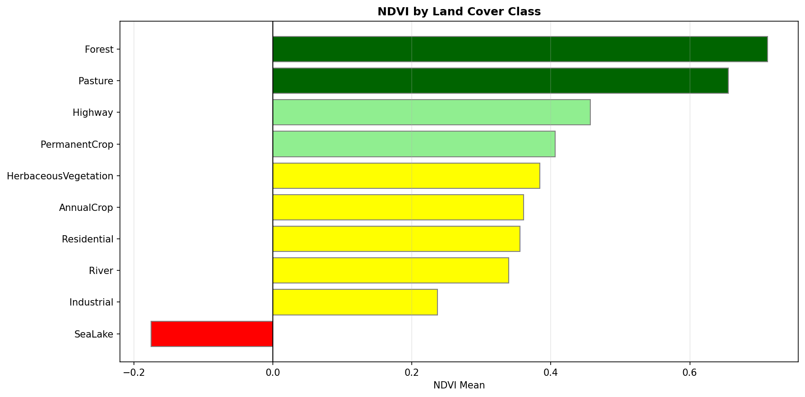 | 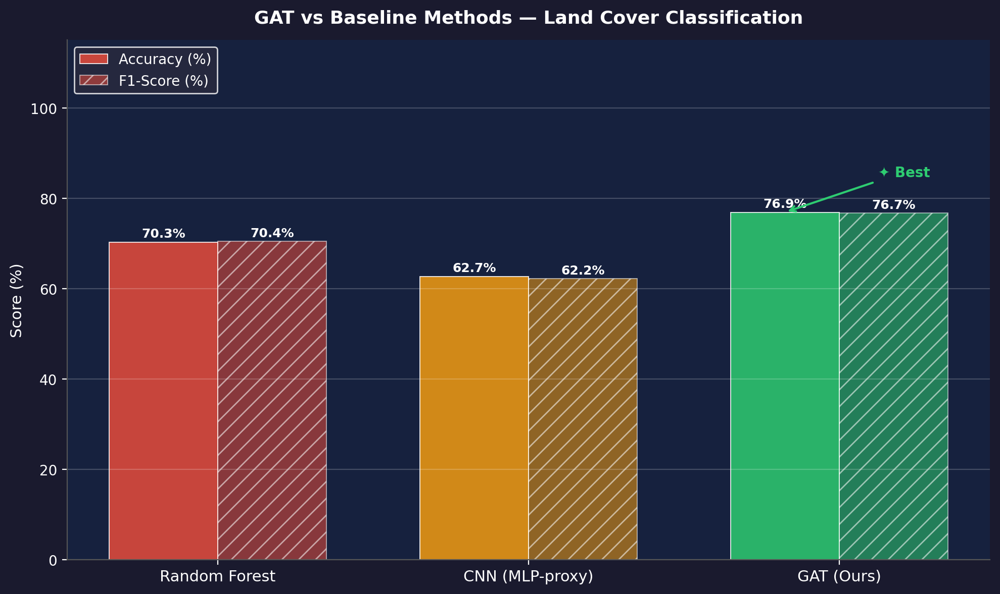 |

### Training History & Confusion Matrix

| Training History | Confusion Matrix |
|:---:|:---:|
| 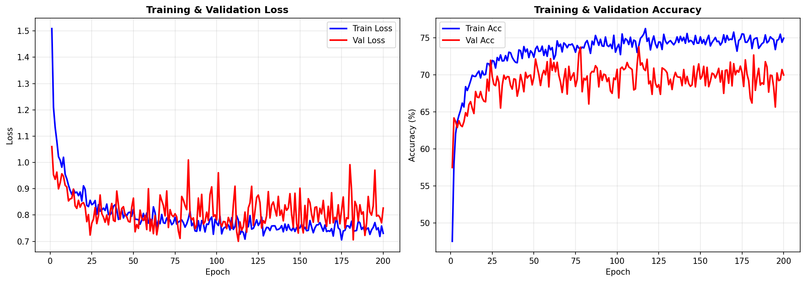 | 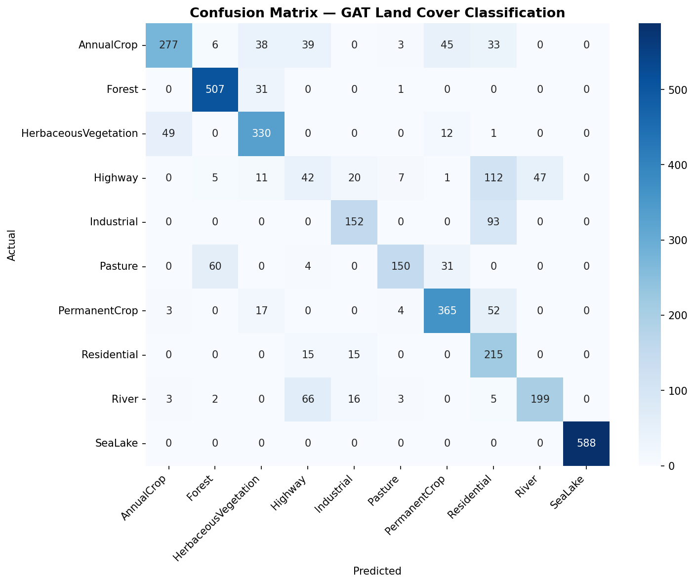 |

### Dataset & Feature Analysis

| Class Distribution | Superpixel Stats |
|:---:|:---:|
| 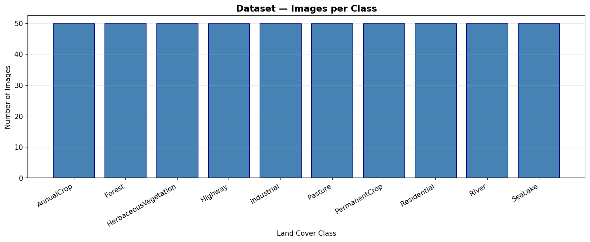 | 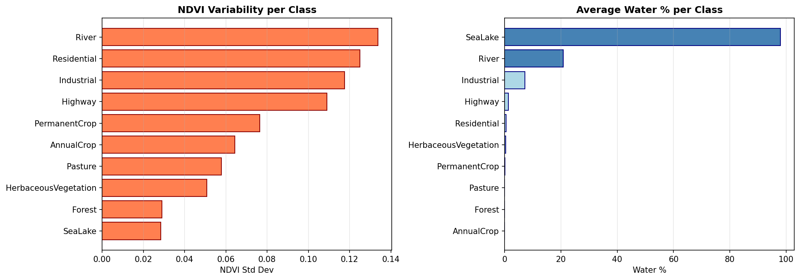 |

### Per-Image Land Cover Analysis

| All Results Overview |
|:---:|
| 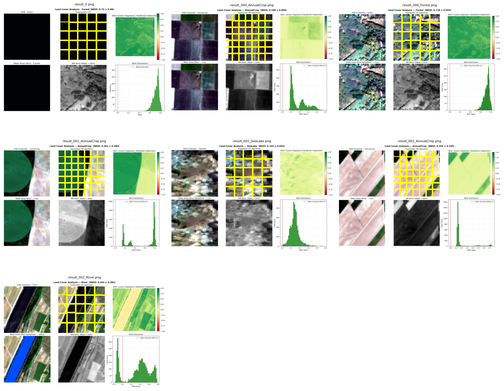 |


### GAT Land Cover Maps

> The following maps show RGB input (left), SLIC segmentation (center), and GAT-predicted land cover (right) for test images.

<!-- Land cover map grid -->

| Map 1 | Map 2 | Map 3 |
|:---:|:---:|:---:|
| 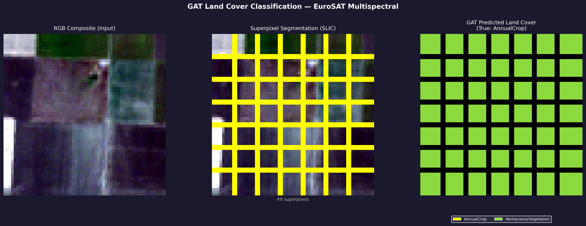 | 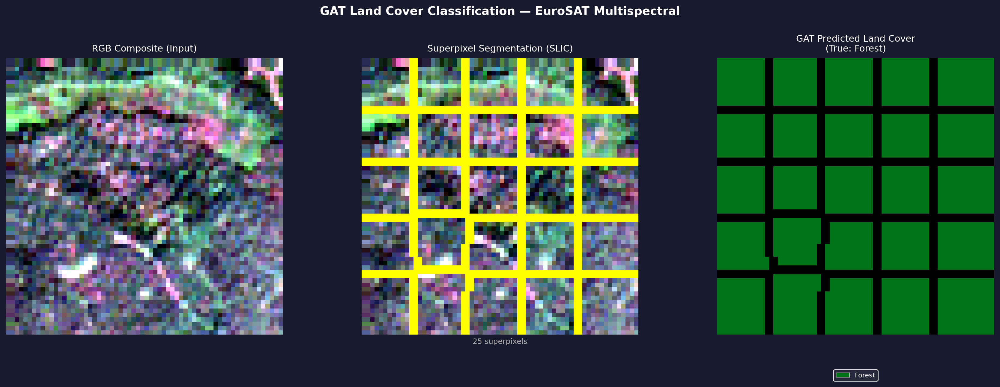 | 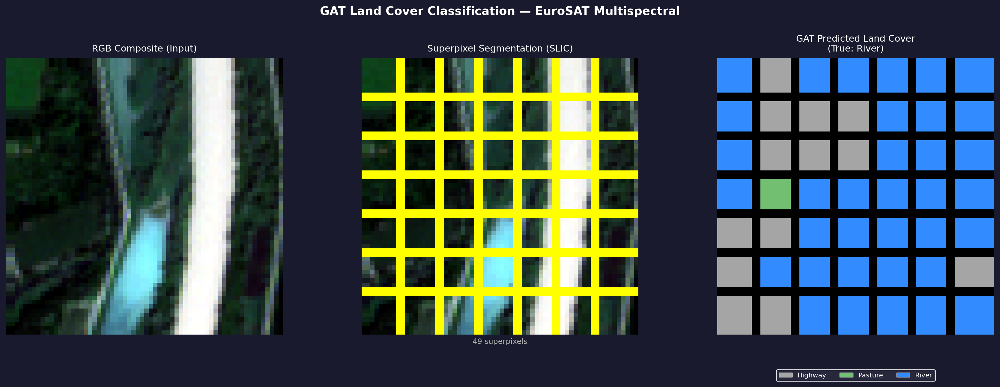 |

| Map 4 | Map 5 | Map 6 |
|:---:|:---:|:---:|
| 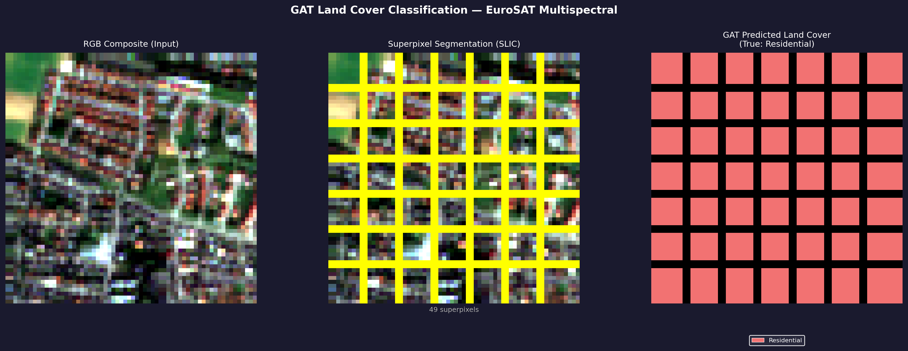 | 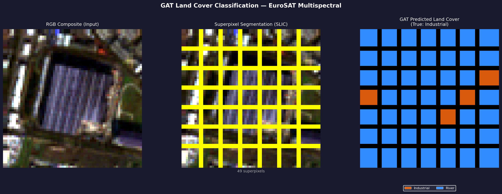 | 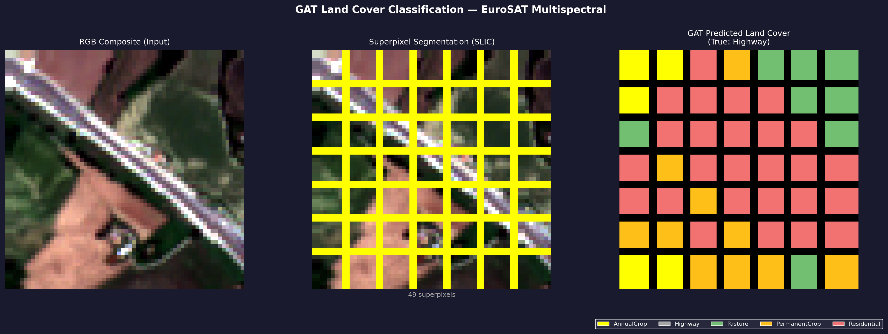 |

| Map 7 | Map 8 | Map 9 |
|:---:|:---:|:---:|
| 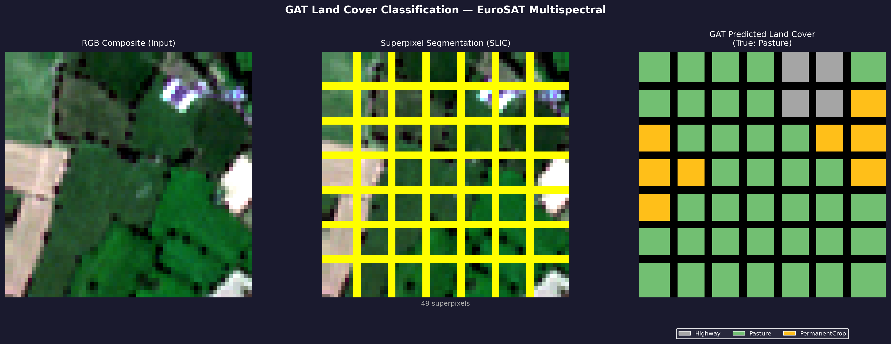 | 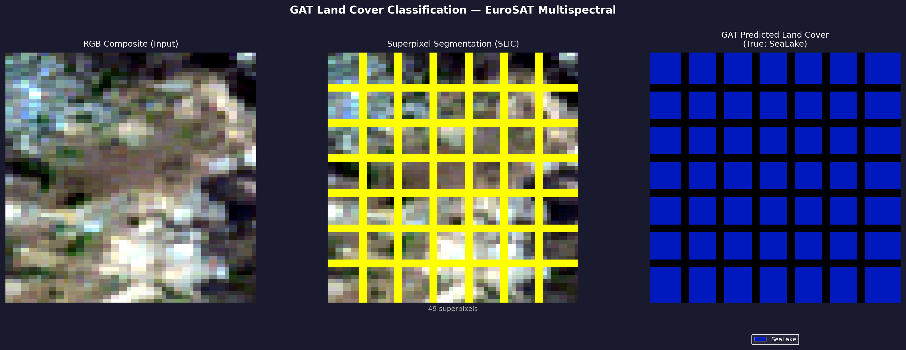 | 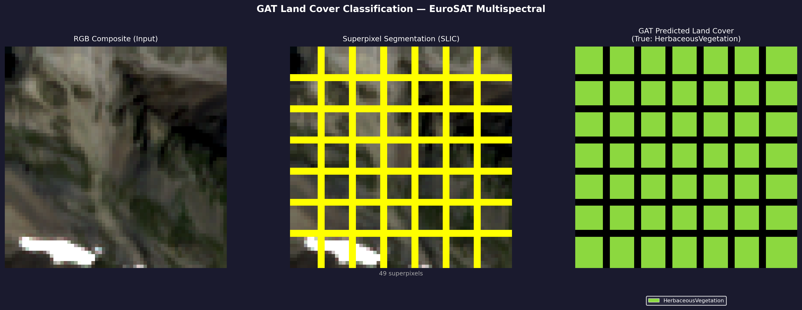 |

---

## 📁 File Structure

```
.
├── main.py                  ← Core logic: preprocessing, SLIC, graph builder, GAT model, training
├── run.py                   ← End-to-end pipeline (Steps 1–11 execution)
├── show_results.py          ← Generates analysis charts from features.csv
├── test.py                  ← Quick sanity check before full run
├── requirements.txt         ← Python dependencies
│
├── features.csv             ← Extracted superpixel features (auto-generated)
├── gat_model.pth            ← Trained GAT model weights (auto-generated)
│
├── ndvi_analysis.png        ← NDVI distribution across classes
├── baseline_comparison.png  ← GAT vs RF vs CNN comparison
├── training_history.png     ← Loss & accuracy curves
├── confusion_matrix.png     ← Class-wise prediction performance
├── class_distribution.png   ← Dataset class balance
├── superpixel_stats.png     ← Graph/node statistics
├── all_results_overview.png ← Combined visual summary
│
├── land_cover_maps/         ← Final GAT predictions (IMPORTANT OUTPUT)
│   ├── map_000_AnnualCrop.png
│   ├── map_008_Forest.png
│   ├── map_030_Highway.png
│   ├── map_042_Industrial.png
│   ├── map_101_HerbaceousVegetation.png
│   ├── map_266_Pasture.png
│   ├── map_361_Residential.png
│   ├── map_406_River.png
│   ├── map_450_SeaLake.png
│   └── ... more generated maps
│
├── allBands/                ← EuroSAT dataset (NOT uploaded to GitHub)
│   ├── AnnualCrop/
│   ├── Forest/
│   ├── HerbaceousVegetation/
│   ├── Highway/
│   ├── Industrial/
│   ├── Pasture/
│   ├── PermanentCrop/
│   ├── Residential/
│   ├── River/
│   └── SeaLake/
│
└── Minor_II_Synopsis.pdf    ← Project synopsis/report
```

---

## 🧠 Key Concepts

**Why GAT over CNN?**
CNN processes fixed pixel grids — satellite regions are irregular (rivers curve, forests spread unevenly). GAT uses flexible graph structure to model these spatial relationships naturally.

**Why SLIC before GAT?**
Direct pixel-level GNN on 4096 pixels = ~32k edges per image. SLIC reduces to 30 nodes and ~80 edges while preserving semantic regions.

**Why NDVI < 0 = Water?**
Water strongly absorbs NIR light → NIR < Red → (NIR−Red)/(NIR+Red) < 0. This physical relationship makes NDVI a reliable water detector.

---

## 📚 References

1. Velickovic et al. (2018). Graph Attention Networks. ICLR.
2. Dong et al. (2022). Weighted Feature Fusion of CNN and GAT for HSI Classification. IEEE TIP, 31.
3. Lin et al. (2022). Multilabel Aerial Image Classification with Concept Attention GNN. IEEE TGRS, 60.
4. Achanta et al. (2012). SLIC Superpixels. IEEE TPAMI, 34(11).
5. Helber et al. (2019). EuroSAT: A Novel Dataset and Deep Learning Benchmark. IEEE JSTAEORS.

---


<div align="center">
<b>Developed by Aditya Chaturvedi</b>
</div>
